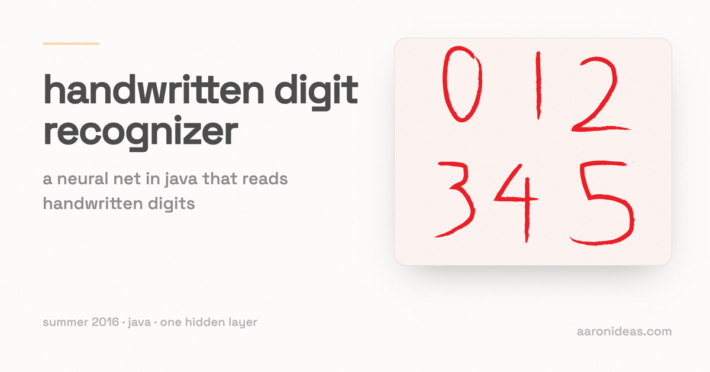

# Backprop Digit Recognizer

*A one-hidden-layer neural network, written in Java from scratch, that reads handwritten digits.*

I wrote this in the summer of 2016 for CS 540 (Introduction to Artificial Intelligence) at UW-Madison. The assignment was a neural network that reads a file of black-and-white handwritten digits and classifies each one. The required version only had to tell 0, 1, and 2 apart. Recognizing all ten digits, 0 through 9, was the extra credit. This is my successful attempt at the extra credit.

There is no library doing the work here. Back-propagation lives in `src/NNImpl.java` and the sigmoid activation in `src/Node.java`.

## Usage

The main method is in `HW4.java` (technically `HW4.class`, in the `bin` folder). From a terminal:

```
java HW4 (numberOfHiddenNodes) (learningRate) (maxEpoch) (trainFile) (testFile)
```

For example, training on all ten digits:

```
java HW4 30 0.1 100 train2.txt test2.txt
```

The program prints every misclassified test instance, then the total number of instances and how many it got right.

### Parameters

- **numberOfHiddenNodes** — how many nodes are in the hidden layer. Raising this generally makes classifications more accurate, since there are more possible combinations of weights between the layers.
- **learningRate** — how far the weights move on each update. It must be greater than 0 and no larger than 1.
- **maxEpoch** — how many times to run the training set. On each epoch the training set uses a back-propagation algorithm to set the weights between layers. The activation function is the sigmoid, which worked better for me than a step function.
- **trainFile** — the labelled data the network learns from.
- **testFile** — the labelled data used only to check the answers.

## Data format

The train and test files are plain text. Each line is one character: 256 bits, separated by spaces, for a 16x16 image, followed by a one-hot classification.

For example, one line of a train file looks like:

```
(characterBits) 0 1 0
```

The `0 1 0` means those bits are the handwritten digit "1". The test file has the same shape, but the program uses the label only to check whether it classified the digit correctly.

Four data files are included:

- `train1.txt` and `test1.txt` — three classes, digits 0 through 2, for the base assignment.
- `train2.txt` and `test2.txt` — ten classes, digits 0 through 9, for the extra credit.

`view.py` prints one digit as ASCII art so you can see what the network sees:

```
python view.py --file=train1.txt --index=10
```

## Layout

- `src/` — `HW4.java` (entry point and file parsing), `NNImpl.java` (the network, training, and back-propagation), `Node.java` (a unit and its sigmoid activation), `NodeWeightPair.java`, `Instance.java`.
- `bin/` — compiled classes.
- `view.py` — the digit viewer.

## Credit

Thanks to the folks at UC Irvine for the training set. The data is derived from the [Semeion handwritten digit data set](https://archive.ics.uci.edu/ml/datasets/Semeion+Handwritten+Digit).
